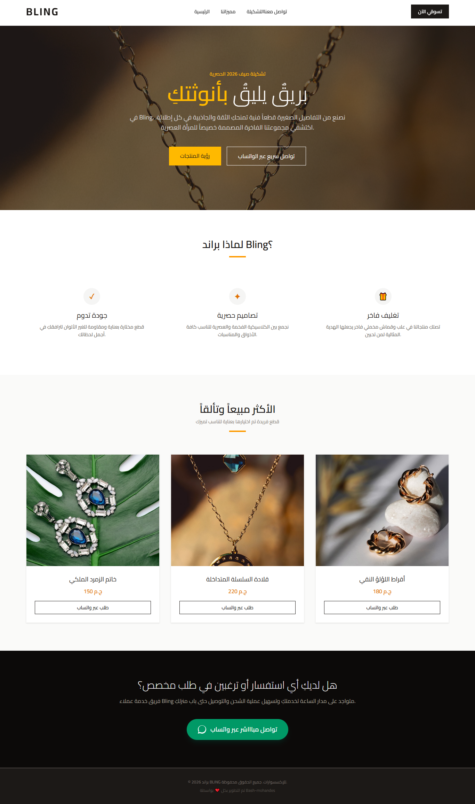

# Bling Luxury Landing Page 💎

A premium, high-performance, and SEO-optimized landing page designed and developed for **Bling**, an exclusive women's accessories and jewelry brand. 

This project was built with a real-world freelance mindset, prioritizing blistering load speeds, clean semantic structure for search engines, and an effortless content-updating workflow.

## 🚀 Key Features

*   **⚡ Ultra-Fast & Lightweight:** Built using native Vanilla JavaScript with zero heavy framework overhead, ensuring top-tier performance and near-instant loading times.
*   **🔍 SEO-Friendly Architecture:** Fully semantic HTML5 structure that allows search engine crawlers (like Google) to index the page content effortlessly.
*   **📱 100% Fully Responsive:** Meticulously crafted layout using **Tailwind CSS**, providing a flawless, luxury user experience across mobile devices, tablets, and desktops.
*   **⚙️ Low-Code Content Management:** Developed with a highly maintainable architecture where product data (titles, prices, images) is decoupled into a clean JavaScript array (`productsData`). This allows non-technical clients to add, remove, or modify products in seconds without touching complex HTML.
*   **✨ Seamless UX:** Integrated with native CSS smooth scrolling navigation for fluid section transitions.

## 🛠️ Tech Stack

*   **Markup:** Semantic HTML5
*   **Styling:** Tailwind CSS (Utility-first framework)
*   **Scripting:** Vanilla JavaScript (ES6+ Dynamic DOM Manipulation)
*   **Fonts:** Cairo (Google Fonts via preconnect optimization)

## ✒️ Author
Developed with ❤️ by **Bash-mohandes**
